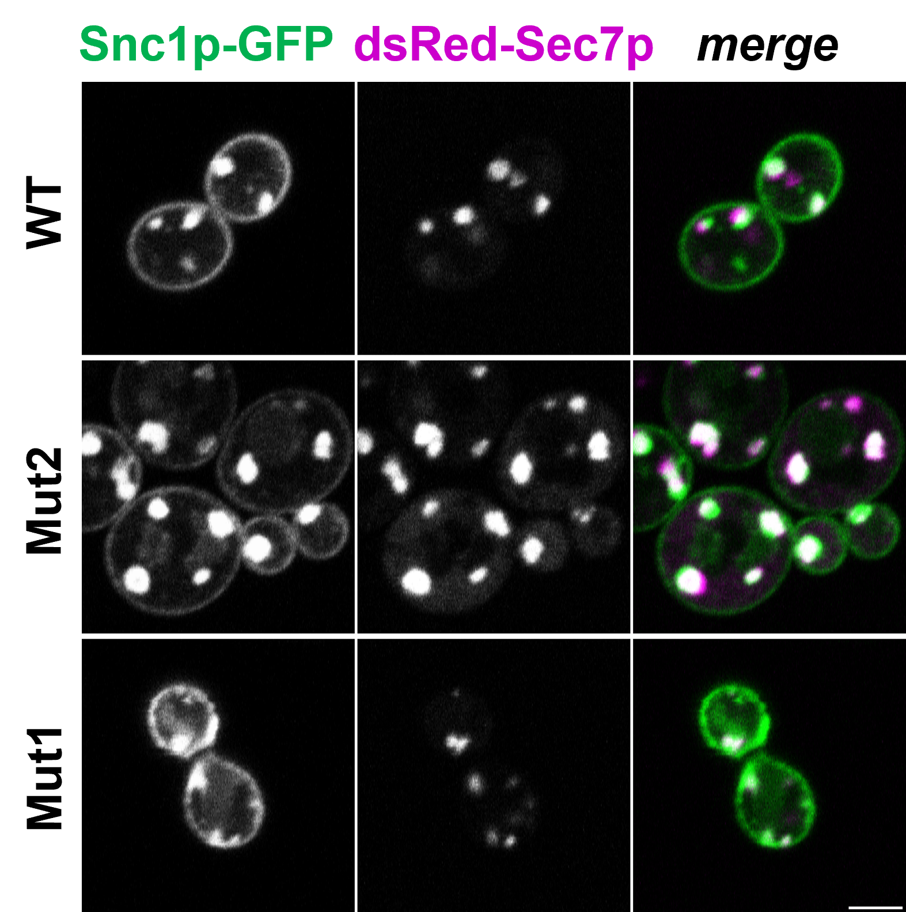

\newpage

{fig-align="center"}

\newpage

# Introduction

## What Is Colocalization?

Suppose you are given some images by a colleague, or have some images of your own, and you want to measure the amount of colocalization between two of the dyes or stains in the images. First you have to define what you mean by colocalization, and that is not trivial. Generally speaking, when we evaluate colocalization, we are usually attempting to demonstrate that a significant, non-random spatial correlation exists between two channels of a dual color image. The specific nature of that correlation, and what it means for your research, can vary quite a bit. It could mean that one signal of one channel is contained within the bounds of another, or that your stains/dyes are typically found separated by a certain distance or are generally clustered, or simply that the signal from both channels overlap each other when imaged at a particular spatial resolution. Importantly, colocalization results cannot indicate that two proteins/molecules are bound or interacting, only that they are both localized to within a certain volume, and is mostly dependent upon your microscope and its acquisition parameters. Regardless of your microscope, this volume is many, many times greater than the volume of a single protein. For this reason, colocalization is most often used to determine if a protein is localizing to an organelle or other well defined cellular structure.

## Pixel-Wise Methods

In pixel-wise colocalization analyses, the intensity of a pixel in one channel is evaluated against the corresponding pixel in the second channel of a dual-color image, generally producing a scatterplot from which a correlation coefficient is determined. As these methods are straightforward, work very well with traditional widefield fluorescence imaging, and are very well founded as some of the earliest methods for measuring colocalization, they are very widely used. However, the pixel-wise matching means that there must be overlap of the signal from the two channels to demonstrate positive spatial correlation. This can be problematic for super-resolution microscopy images, where the improved resolution means that even close, strongly-correlated proteins may not produce sufficient overlap after imaging to work with these colocalization methods. Additionally, it is critical that the spatial resolution is reported when using this method, as the scale and resolution of the image can affect the results and their interpretation!

Here are just two of many colocalization coefficients to express the intensity correlation of pixel-wise colocalizing objects in each component of a dual-color image:\

1.  Pearson’s correlation coefficient. It is not sensitive to differences in mean signal intensities or range, or a zero offset between the two components. The result is +1 for perfect correlation, 0 for no correlation, and -1 for perfect anti-correlation. Noise makes the value closer to 0 than it should be.\
2.  Manders split coefficients. Proportional to the amount of fluorescence of the colocalizing pixels or voxels in each colour channel. You can get more details in Manders et al. Values range from 0 to 1, expressing the fraction of intensity in a channel that is located in pixels where there is above zero (or threshold) intensity in the other colour channel.\

These coefficients measure the amount or degree of colocalization, or rather correlation and co-occurrence respectively (but should not be expressed as % values, because that is not how they are defined). But if there is nothing to compare them to, what do they mean? A statistical significance test was derived by Costses to evaluate the probability that the measured value of Pearson’s correlation r between the two colour channels is significantly greater than values of r that would be calculated if there was only random overlap of the same information. This test is performed by randomly scrambling the blocks of pixels (instead of individual pixels, because each pixel’s intensity is correlated with its neighboring pixels) in one image, and then measuring the correlation of this image with the other (unscrambled) image. You can get more details in Costes et al. The result of this tests tell us if the Pearsons r and split Manders’ coefficients we measure are better than pure chance or not.

\newpage

# Real World Data

Next, I will share some real data from my PhD studies. In this experiment the colocalization between two proteins was measured in 3 different *S. cerevisiae* strains: a wild type as a control and two mutant strains (WT, Mut1, Mut2 respectively). For each strain, the PCC has been measured in multiple cells. This experiment was repeated three times, yielding three biological replicates for every strain. Below is a recreated figure from my PhD-thesis of what a finished analysis looks like.

{fig-align="center"}

This is a figure which can be found in many publications. Most likley in the description can be found that statistical analysis was performed by an ordinary one-way ANOVA with a post-hoc Bonferroni test. In this figure, the PCC values of each biological replicate per strain was averaged and plotted, with the mean of the three biological replicates show with the SEM, calculated from these three data points each. This is the accepted standard for colocalization data. Sadly, some more nefarious researcher will show a figure like this, but will calculate the statistics on the cell level, resulting in very high Ns and small p-values.

With the knowledge obtained in this course, this analysis and figure can be improved.

\newpage

# Re-Analysis Of Data

## Setup

Load in all needed packages. Then read in the data.

```{r Setup}
pacman::p_load(
 conflicted, tidyverse, here, ggplot2, wrappedtools, car, broom,
 ggbeeswarm, readxl, ggsignif, flextable, DescTools, lme4, easystats,
 ggsignif)

conflicts_prefer(
  dplyr::select,
  dplyr::filter,
  ggplot2::mean_cl_boot,
)
```

```{r Reading in data}
#| output: false
rawdata <- read_excel(
  path = here("Data/Coloc_Example.xlsx")
  )
head(rawdata)
```

After reading in the data, the columns Strain and Replicate will be transformed into factors.

```{r Data preparation}
#| echo: true 
#| output: false
rawdata <- mutate(
  .data = rawdata,
  Replicate = as.factor(Replicate),
  Strain = factor(Strain,
                     levels = c("WT", "Mut1", "Mut2")),
  Cell = factor(Cell)) |> 
  arrange(Strain, Replicate, Cell)
head(rawdata)
```

## Averaging Of PCC-values

The PCC values measured per cell within a biological replicate are not the same was technical replicates. They can be best described as pseudoreplicates.

```{r}
#| echo: true 
mean_pcc <- rawdata |> group_by(Strain, Replicate) |>
  summarise(across(
  .cols = PCC,
  .fns = list(
    Mean = \(x) mean(x),
    SD = \(x) sd(x))),
  .groups = "drop"
  )
mean_pcc <- mean_pcc |> rename(PCC = PCC_Mean, SD = PCC_SD) 
mean_pcc |> flextable() |> merge_v(j = 1) |> hline(c(3,6))
```

## Data Exploration

```{r}
ggplot(mean_pcc, aes(Strain, PCC, color = Replicate)) +
  geom_beeswarm(size = 3, cex = 2) +
  stat_summary(fun = mean,
    fun.min = function(x) mean(x) - 2 * sd(x)/sqrt(length(x)),
    fun.max = function(x) mean(x) + 2 * sd(x)/sqrt(length(x)),
    position = position_dodge(width = 0.75),
    shape = "-",
    color = "black",
    size = 4) +
  ylab("PCC\n mean \u00b1 95% CI")
```

This plot is very reminiscent of the one shown before. However, it can still be improved, especially since this plot also does not show the real rawdata.

```{r superplot}
#| echo: true 
superplot <- ggplot(mean_pcc, aes(Strain, PCC, color = Replicate)) +
  geom_beeswarm(data = rawdata, aes(Strain, PCC), 
                cex = 2, size = 2, alpha = .25) +
  geom_beeswarm(size = 3, cex = 2) +
  stat_summary(fun = mean,
    fun.min = function(x) mean(x) - 2 * sd(x)/sqrt(length(x)),
    fun.max = function(x) mean(x) + 2 * sd(x)/sqrt(length(x)),
    position = position_dodge(width = 0.75),
    shape = "-",
    color = "black",
    size = 4)

superplot + scale_y_continuous(name = "PCC\n mean \u00b1 95% CI",
                     limits = c(-0.4, 1), n.breaks = 8)
```

This plot now shows the raw PCC data superimposed by the summary values. Now the distribution of the data is visible. This for example reveals unexpected negative value in the third replicate of the Mut1 strain.

## Statistical Analysis

First, let's think about what we actually want to show: the aim of this experiment was to show that introducing a mutation into the yeast strain will lead that to proteins, which normally would reside in different cell organelles would now be in the same organelle and thus colocalize. To put it into a work hypothesis: The mean PCC will be different from the control strain (WT) depending on the mutation (Mut1, Mut2). Looking into the data and the plot above, one can see, that the individual PCC values of the cells are nested within replicates nested within strains. Thus a linear mixed effect model (LMM) seems appropriate.

### Building An LMM With Random Intercept

```{r LMM with random intercept}
#| echo: true
#| output: false
lmer_out <- lmer(PCC ~ Strain + (1 | Replicate), data = rawdata)
Anova(lmer_out)
(lmer_out_param <- model_parameters(lmer_out, group_level = T))
# Coeffs are all zero
```

```{r Quick data exploration}
#| echo: true
#| output: true
ggplot(rawdata, aes(Replicate, PCC, colour = Strain)) +
  geom_beeswarm(dodge.width = 0.5, alpha = 0.5)
```

```{r Visualization}
#| output: true
intercept_all <- lmer_out_param$Coefficient[1]
slope_Mut1 <- lmer_out_param$Coefficient[2]
slope_Mut2 <- lmer_out_param$Coefficient[3]
plotdata <- tibble(
  Replicate = lmer_out_param$Level[-(1:3)],
  intercept = lmer_out_param$Coefficient[-(1:3)] +
    intercept_all
)

p1 <- rawdata |> filter(Strain != "Mut2") |>
  ggplot(aes(Strain, PCC, color = Replicate)) +
  geom_beeswarm(cex = 2, size = 2, alpha = .25) +
  stat_summary(fun = mean,
    fun.min = function(x) mean(x) - 2 * sd(x)/sqrt(length(x)),
    fun.max = function(x) mean(x) + 2 * sd(x)/sqrt(length(x)),
    position = position_dodge(width = 0.75),
    shape = "-",
    color = "black",
    size = 4) +
  geom_abline(
    data = plotdata,
    linetype = 1,
    aes(color = Replicate,
        intercept = intercept,
        slope = slope_Mut1)
  ) +
  geom_abline(
    colour = "black", linetype = 2,
              aes(
                intercept = intercept_all,
                slope = slope_Mut1
  )) +
  scale_y_continuous(name = "PCC\n mean \u00b1 95% CI",
                     limits = c(-0.4, 1), n.breaks = 8)

p2 <- rawdata |> filter(Strain != "Mut1") |>
  ggplot(aes(Strain, PCC, color = Replicate)) +
  geom_beeswarm(cex = 2, size = 2, alpha = .25) +
  stat_summary(fun = mean,
    fun.min = function(x) mean(x) - 2 * sd(x)/sqrt(length(x)),
    fun.max = function(x) mean(x) + 2 * sd(x)/sqrt(length(x)),
    position = position_dodge(width = 0.75),
    shape = "-",
    color = "black",
    size = 4) +
  geom_abline(
    data = plotdata,
    linetype = 1,
    aes(color = Replicate,
        intercept = intercept,
        slope = slope_Mut2)
  ) +
  geom_abline(
    colour = "black", linetype = 2,
              aes(
                intercept = intercept_all,
                slope = slope_Mut2
  )) +
  scale_y_continuous(name = "PCC\n mean \u00b1 95% CI",
                     limits = c(-0.4, 1), n.breaks = 8)

(p1 + p2)
```

Some extended thoughts: In cell biology, three biological replicates are often seen has some kind of holy number without regard to the actual power needed to observe an effect. In this case here we tried to build a model with 3 replicates per strain. This means were are trying to estimate a between-replicate variance component from just 3 data points per group (9 total). The model would profit from more data points. But there is still the cell-level data which could be used to build a model. But beware: building a linear model with `lm(PCC ~ Strain)` would treat every cell as an independent replicate. But cells from the same replicate share whatever made that replicate unique that day, like reagent batch, exact culture conditions, imaging session, minor prep variation. They're correlated, not independent. Feeding that correlated data into a model that assumes independence:\

- Artificially shrinks the standard errors (because SE ∝ 1/√N, and the effective N is way smaller than the nominal N)\

- Artificially shrinks p-values as a direct consequence\

- This is classic **pseudoreplication**, probably the single most common statistical error in cell biology papers\

**THIS WOULD BE P-HACKING!** So what would be a good way to model the data? The LMM above was on a good way, and an LMM build upon the cell-level data utilizing `(1 | Replicate)` random effect would explicitly model that within-replicate correlation and correctly inflate the standard errors back to reflect the true Replicate-level uncertainty, so the p-values end up appropriately conservative rather than falsely significant. When it works properly, an LMM on cell-level data and an ANOVA on replicate-means should give similar conclusions - the LMM isn't cheating, it's just using the cell-level data more efficiently while still being honest about the real N.

### Building An LMM With Random Slope

```{r LMM with random slope and intercept}
#| echo: true
#| output: false
lmer_out2 <- lmer(PCC ~ Strain + (1 + Strain | Replicate),
                  data = rawdata,
                  REML = FALSE)
Anova(lmer_out2)
(lmer_out2_param <- model_parameters(lmer_out2, group_level = T))
```

To fix: Add mean PCC points into the plots

```{r}
#| output: true
intercept_all <- lmer_out2_param$Coefficient[1]
slope_Mut1 <- lmer_out2_param$Coefficient[2]
slope_Mut2 <- lmer_out2_param$Coefficient[3]
plotdata <- tibble(
  Replicate = lmer_out2_param$Level[(4:6)],
  intercept = lmer_out2_param$Coefficient[(4:6)] +
    intercept_all,
  slope_Mut1 = lmer_out2_param$Coefficient[(7:9)] + slope_Mut1,
  slope_Mut2 = lmer_out2_param$Coefficient[(10:12)] + slope_Mut2
)

p1 <- rawdata |> filter(Strain != "Mut2") |>
  ggplot(aes(Strain, PCC, color = Replicate)) +
  geom_beeswarm(cex = 2, size = 2, alpha = .25) +
  stat_summary(fun = mean,
    fun.min = function(x) mean(x) - 2 * sd(x)/sqrt(length(x)),
    fun.max = function(x) mean(x) + 2 * sd(x)/sqrt(length(x)),
    position = position_dodge(width = 0.75),
    shape = "-",
    color = "black",
    size = 4) +
  geom_abline(
    data = plotdata,
    linetype = 1,
    aes(color = Replicate,
        intercept = intercept,
        slope = slope_Mut1)
  ) +
  geom_abline(
    colour = "black", linetype = 2,
              aes(
                intercept = intercept_all,
                slope = slope_Mut1
  )) +
  scale_y_continuous(name = "PCC\n mean \u00b1 95% CI",
                     limits = c(-0.4, 1), n.breaks = 8)

p2 <- rawdata |> filter(Strain != "Mut1") |>
  ggplot(aes(Strain, PCC, color = Replicate)) +
  geom_beeswarm(cex = 2, size = 2, alpha = .25) +
  stat_summary(fun = mean,
    fun.min = function(x) mean(x) - 2 * sd(x)/sqrt(length(x)),
    fun.max = function(x) mean(x) + 2 * sd(x)/sqrt(length(x)),
    position = position_dodge(width = 0.75),
    shape = "-",
    color = "black",
    size = 4) +
  geom_abline(
    data = plotdata,
    linetype = 1,
    aes(color = Replicate,
        intercept = intercept,
        slope = slope_Mut2)
  ) +
  geom_abline(
    colour = "black", linetype = 2,
              aes(
                intercept = intercept_all,
                slope = slope_Mut2
  )) +
  scale_y_continuous(name = "PCC\n mean \u00b1 95% CI",
                     limits = c(-0.4, 1), n.breaks = 8)

(p1 + p2)
```

### Post-Hoc Analysis

As both `Anova(lmer_out)` and `Anova(lmer_out2)` showed that in both cases there is a significant difference between the strains, we are justified to search for this difference with a post-hoc analysis. As written before, we are interested in just a difference between the WT strain and the mutant strains, not in differences between the mutant strains.

```{r}
#| echo: true
#| output: true
pt_out <- pairwise.t.test(
  x = mean_pcc$PCC,
  g = mean_pcc$Strain,
  p.adjust.method = "none"
)

pt_out_adj <- p.adjust(pt_out$p.value[, 1], method = "fdr")

superplot + scale_y_continuous("PCC \nmean ± 95% CI",
                     expand = expansion(mult = .15)) +
  geom_signif(comparisons = list(c(1, 2), c(1, 3)),
              annotations = paste("p",
                                  formatP(pt_out_adj,
                                          pretext = T,
                                          mark = T)),
              color = "black",
              y_position = c(0.8, 1))
```

### Nesting cell-level data into replicates

```{r}
#| echo: true
#| output: false

rawdata <- rawdata |> mutate(Cell = as.numeric(Cell))

lmer_out_nested <- lmer(PCC ~ Strain + (1 + Strain | Replicate / Cell),
                  data = rawdata,
                  REML = FALSE)
Anova(lmer_out_nested)
(lmer_out_nested_param <- model_parameters(
  lmer_out_nested, group_level = T))
```

This will produce an error : `Error: number of observations (=166) <= number of random effects (=216) for term (1 + Strain | Cell:Replicate); the random-effects parameters and the residual variance (or scale parameter) are probably unidentifiable`

# Time series
```{r}
#| output: false
rawdata <- read_excel(
  path = here("Data/Coloc_Example.xlsx"),
  sheet = "Timeseries"
  )

rawdata <- mutate(
  .data = rawdata,
  Replicate = as.factor(Replicate),
  Strain = factor(Strain,
                     levels = c("WT", "Mut1")),
  Cell = factor(Cell))

head(rawdata)
```

```{r}
ggplot(rawdata, aes(
  x = `Time [min]`, 
  y = PCC, 
  color = Strain)) +
  geom_beeswarm(dodge.width = 2, alpha = 0.25) +
  stat_summary(
    fun.data = "mean_cl_normal", 
    position = position_dodge(2),
    ) +
  stat_summary(
    geom = "line", 
    fun = "mean",
    position = position_dodge(2)) +
  ylab("PCC \nmean ± 95% CI")

ggplot(rawdata, aes(
  x = `Time [min]`, 
  y = PCC, 
  color = Strain)) +
  geom_beeswarm(dodge.width = 2, alpha = 0.25) +
  stat_summary(
    fun.data = "mean_cl_normal", 
    position = position_dodge(2),
    ) +
  geom_smooth(position = position_dodge(2)) +
  geom_smooth(method = "lm", position = position_dodge(2))
  ylab("PCC \nmean ± 95% CI")

ggplot(rawdata, aes(
  x = `Time [min]`, 
  y = PCC, 
  color = Strain, 
  shape = Replicate)) +
  geom_beeswarm(dodge.width = 2, alpha = 0.25) +
  stat_summary(
    fun.data = "mean_cl_normal", 
    position = position_dodge(2),
    ) +
  ylab("PCC \nmean ± 95% CI")

rawdata |>
  ggplot(aes(`Time [min]`, PCC, color = Cell)) +
  geom_point() +
  geom_line(aes(group = Cell)) +
  facet_grid(Replicate ~ Strain)
```

```{r}

```